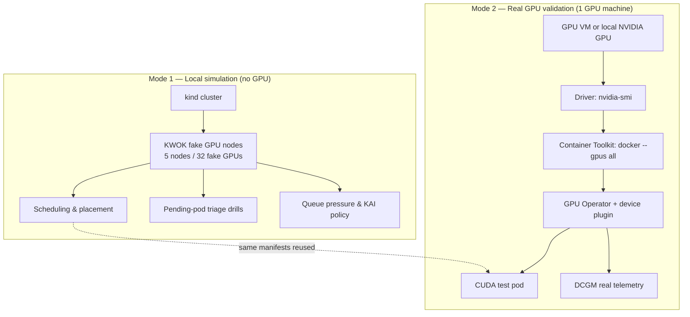

# Fake vs Real GPU Validation Map

```mermaid
flowchart TB
    subgraph SIM["Mode 1 — Local simulation (no GPU)"]
        KIND[kind cluster] --> KWOK[KWOK fake GPU nodes\n5 nodes / 32 fake GPUs]
        KWOK --> S1[Scheduling & placement]
        KWOK --> S2[Pending-pod triage drills]
        KWOK --> S3[Queue pressure & KAI policy]
    end
    subgraph REAL["Mode 2 — Real GPU validation (1 GPU machine)"]
        VM[GPU VM or local NVIDIA GPU] --> R1[Driver: nvidia-smi]
        R1 --> R2[Container Toolkit: docker --gpus all]
        R2 --> R3[GPU Operator + device plugin]
        R3 --> R4[CUDA test pod]
        R3 --> R5[DCGM real telemetry]
    end
    S1 -.->|same manifests reused| R4
```

Both modes feed `portfolio-lab/06-validation-reports/`. A claim is only made
once its evidence exists in the matching report.
