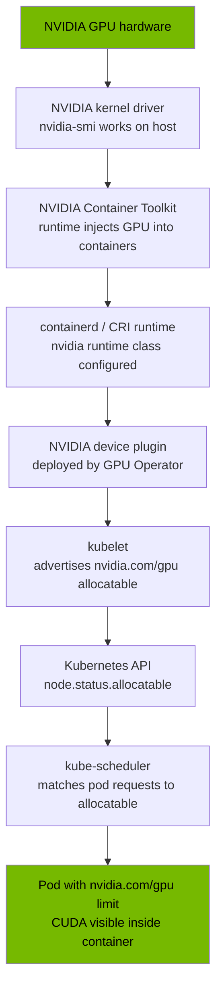
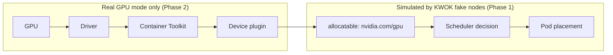

# The GPU Path to a Kubernetes Pod

The single most useful mental model in this lab. Every link is a distinct
failure domain with its own runbook.

## Simulation boundary

KWOK injects `allocatable` directly via the Node object, so everything to the
right of the device plugin is exercised faithfully; everything to the left is
not exercised at all.

## Failure-domain to runbook mapping

| Broken link | Symptom | Runbook |
|---|---|---|
| Driver | `nvidia-smi` fails on host | `runbooks/gpu-node-not-ready.md` |
| Container Toolkit | `docker run --gpus all` fails | `runbooks/gpu-operator-driver-pod-failing.md` |
| Device plugin | node shows 0 `nvidia.com/gpu` | `runbooks/device-plugin-not-advertising-gpus.md` |
| Scheduler fit | pod Pending, Insufficient nvidia.com/gpu | `runbooks/gpu-capacity-planning.md` |
| DCGM | no GPU metrics | `runbooks/dcgm-exporter-no-metrics.md` |
