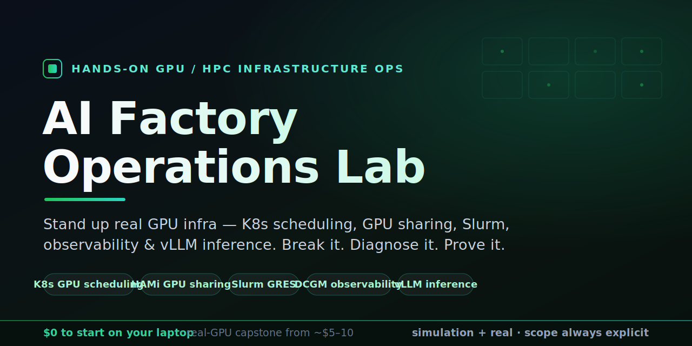

---
hide:
  - navigation
  - toc
---

# AI Factory Operations Lab

{ width="820" }

**A hands-on course in AI/HPC GPU infrastructure operations.** You do not read this
course, you run it: stand things up, break them on purpose, diagnose them the way you
would on a real cluster, and capture the evidence. Most of it needs **no GPU at all**;
one optional session uses a single cheap rented GPU and is clearly marked.

[Get started](portfolio-lab/01-k8s-gpu-platform/README.md){ .md-button .md-button--primary }
[Browse on GitHub](https://github.com/ld-singh/ai-factory-ops-lab){ .md-button }

## The scope boundary

Every lesson declares one of two modes and states exactly what it proves and what it
does not:

- **Simulation (no GPU).** kind + KWOK fake nodes, the fake-gpu-operator, Slurm with
  fake GRES. Proves control-plane behaviour: scheduling, queueing, sharing decisions,
  triage. Nothing below the kubelet.
- **Real GPU (one cheap NVIDIA GPU).** Real driver, container toolkit, CUDA pod, DCGM
  telemetry, enforced GPU sharing. Proves the runtime path, single-node.

Knowing exactly where that line sits is itself one of the skills this course teaches.

## What it costs

| Tier | Lessons | You pay | You get |
|---|---|---|---|
| **$0 simulation** | 0, 1, 1B, 1C, 2, 3, 4, 5 | Nothing, a laptop runs it | Scheduling, queueing, GPU-sharing decisions, triage, observability design, lifecycle - most of the course |
| **$5-10 one GPU session** | 6 (the real-GPU capstone) | A few hours on one entry-level GPU VM | The real runtime path, enforced sharing, real telemetry and benchmarks |

## The lessons

<div class="grid cards" markdown>

-   :material-kubernetes: __1 - Kubernetes GPU scheduling__

    ---

    Build a fake GPU fleet with kind + KWOK and diagnose why GPU pods stay Pending.

    [:octicons-arrow-right-24: Start here](portfolio-lab/01-k8s-gpu-platform/README.md)

-   :material-format-list-numbered: __1B - Queue scheduling (KAI)__

    ---

    Install NVIDIA's KAI Scheduler on a fake fleet and enforce per-team queue quota.

    [:octicons-arrow-right-24: Open](portfolio-lab/01-k8s-gpu-platform/kai-scheduler/README.md)

-   :material-fraction-one-half: __1C - GPU sharing (HAMi)__

    ---

    Fractional GPUs: schedule slices on fakes, then prove memory isolation on one real GPU.

    [:octicons-arrow-right-24: Open](portfolio-lab/01-k8s-gpu-platform/hami/README.md)

-   :material-check-decagram: __2 - Real GPU validation__

    ---

    Prove the full driver to toolkit to device-plugin to pod path on real hardware.

    [:octicons-arrow-right-24: Open](portfolio-lab/01-k8s-gpu-platform/gpu-operator-real/README.md)

-   :material-server: __3 - Slurm workload management__

    ---

    A Slurm-in-Docker cluster with fake GRES: GPU jobs, QoS caps, queue pressure, drain/resume.

    [:octicons-arrow-right-24: Open](portfolio-lab/02-slurm-gpu-platform/README.md)

-   :material-chart-line: __4 - GPU observability__

    ---

    Prometheus/Grafana over synthetic DCGM metrics; build dashboards and trip alerts on purpose.

    [:octicons-arrow-right-24: Open](portfolio-lab/03-observability/README.md)

-   :material-rocket-launch: __5 - Inference serving__

    ---

    A load harness for TTFT, p95/p99, tokens-per-sec; $0 CPU tier, real numbers on a GPU.

    [:octicons-arrow-right-24: Open](portfolio-lab/04-inference-serving/README.md)

-   :material-cog-sync: __6 - Cluster lifecycle__

    ---

    A runnable provision to health-gate to patch to retire node-lifecycle drill, mapped to BCM.

    [:octicons-arrow-right-24: Open](portfolio-lab/05-bcm-style-cluster-lifecycle/README.md)

</div>

## Run the first loop

```bash
git clone https://github.com/ld-singh/ai-factory-ops-lab
cd ai-factory-ops-lab
make check          # verify docker, kind, kubectl, helm, jq
make phase1-up      # kind cluster + KWOK + fake GPU node pools
make phase1-demo    # schedulable + intentionally-Pending GPU workloads
make phase1-down    # tear it down
```

---

⭐ **Finding this useful?** [Star it on GitHub](https://github.com/ld-singh/ai-factory-ops-lab/stargazers)
— it helps other engineers find the course.

Built by **[Lovedeep Singh](https://www.linkedin.com/in/lovedeep-singh-cloud-infra/)** —
Cloud Infrastructure Architect (AWS, Azure, Kubernetes & DevSecOps), building secure, governed
cloud platforms. See [About](about.md) for more.
