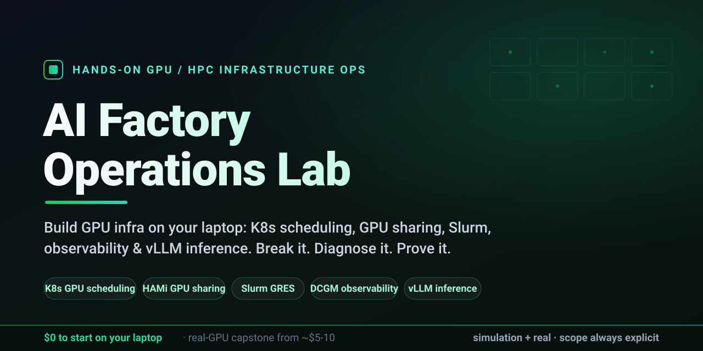

---
hide:
  - navigation
  - toc
---

# Learn GPU Infrastructure Without Owning a GPU

{ .hero-image width="880" }

<p class="hero-subtitle">Hands-on GPU Infrastructure Engineering</p>

**Build, break, troubleshoot and operate production-style AI infrastructure on your laptop.
Then validate the hardware-specific parts on real GPUs.**

<p class="hero-badges">
<span>💻 $0 to start</span>
<span>🚫 No GPU required</span>
<span class="opt">🟥 Optional real-GPU capstone</span>
</p>

[Start Learning](start-here.md){ .md-button .md-button--primary }
[View Learning Path](#the-lessons){ .md-button }

You do not read this course, you run it: stand things up, break them on purpose, diagnose
them the way you would on a real cluster, and capture the evidence. Most of it needs **no GPU
at all**; one optional session uses a single cheap rented GPU and is clearly marked.

---

## How you learn here: Build, Break, Diagnose, Prove

Every lesson runs the same loop, the one an operator actually lives in:

<div class="grid cards" markdown>

-   :material-hammer-wrench: __Build__

    Stand up the system or capability: a fake GPU fleet, a scheduler, a serving stack.

-   :material-flash: __Break__

    Introduce a realistic failure, capacity limit, or queue condition, on purpose.

-   :material-stethoscope: __Diagnose__

    Read the same signals and tools an operator uses in production to find the cause.

-   :material-clipboard-check: __Prove__

    Capture the evidence of what happened and what you fixed. A lesson is "done" only when
    its evidence exists, not when a command runs.

</div>

---

## What it costs

| Tier | Lessons | You pay | You get |
|---|---|---|---|
| **$0 simulation** | 1 through 5 (with 1B/1C/1D, 3B, 4A/4B) | Nothing, a laptop runs it | Scheduling, queueing, gang scheduling, GPU-sharing decisions, observability design, inference and capacity, lifecycle. Most of the course |
| **$5-10 one-GPU capstone** | 6 | A few hours on one entry-level GPU VM | The real runtime path, enforced GPU sharing, real telemetry and inference benchmarks |

Every lesson declares its **mode** and states exactly what it proves and what it does not:

- **🟦 Simulation (no GPU).** kind + KWOK fake nodes, the fake-gpu-operator, Slurm with fake
  GRES, synthetic DCGM and vLLM metrics. Proves control-plane behaviour: scheduling, queueing,
  sharing *decisions*, observability *design*. Nothing below the kubelet.
- **🟥 Real GPU (one cheap NVIDIA GPU).** Real driver, container toolkit, CUDA pod, DCGM
  telemetry, enforced GPU sharing, real inference numbers. Proves the runtime path, single node.

Knowing exactly where that line sits is itself one of the skills this course teaches.

---

## The lessons

New here? **[Start Here](start-here.md)** first for orientation, then work the lessons in order.
Each card leads with what you will be able to *do*.

<div class="grid cards" markdown>

-   :material-kubernetes: __1 · Diagnose why a GPU pod stays Pending__

    ---

    🟦 Simulation · No GPU · Beginner · ~30-45 min (est)

    Build a fake GPU fleet with kind + KWOK and the fake-gpu-operator, then walk the
    driver-to-pod path to find why work will not schedule.

    [:octicons-arrow-right-24: Open](portfolio-lab/01-k8s-gpu-platform/README.md)

-   :material-format-list-numbered: __1B · Control GPU access between teams__

    ---

    🟦 Simulation · No GPU · Intermediate · ~30 min (est)

    NVIDIA KAI Scheduler · queue quotas · borrowing · gang scheduling, enforced on a fake fleet.

    [:octicons-arrow-right-24: Open](portfolio-lab/01-k8s-gpu-platform/kai-scheduler/README.md)

-   :material-fraction-one-half: __1C · Share one GPU between pods__

    ---

    🟦 Simulation (+🟥 real half in 6) · Intermediate · ~30 min (est)

    HAMi fractional GPUs: prove the scheduling *decision* on fakes; the enforced memory slice
    is proven on a real GPU in the capstone.

    [:octicons-arrow-right-24: Open](portfolio-lab/01-k8s-gpu-platform/hami/README.md)

-   :material-chart-timeline-variant: __1D · Watch gang scheduling refuse a job__

    ---

    🟦 Simulation · No GPU · Intermediate · ~30 min (est)

    Volcano · topology-driven fake fleets · Queue / PodGroup gang scheduling, all-or-nothing.

    [:octicons-arrow-right-24: Open](portfolio-lab/01-k8s-gpu-platform/volcano-scale-sim/README.md)

-   :material-server: __2 · Schedule GPU jobs on an HPC cluster__

    ---

    🟦 Simulation · No GPU · Intermediate · ~40 min (est)

    Slurm-in-Docker with fake GRES · GPU jobs · QoS caps · queue pressure · drain and resume.

    [:octicons-arrow-right-24: Open](portfolio-lab/02-slurm-gpu-platform/README.md)

-   :material-chart-line: __3 · See a GPU fleet and trip its alerts__

    ---

    🟦 Simulation · No GPU · Beginner · ~20 min

    Prometheus · Grafana · synthetic DCGM · build dashboards and break them on purpose.

    [:octicons-arrow-right-24: Open](portfolio-lab/03-observability/README.md)

-   :material-speedometer: __3B · Alert on token-level inference SLOs__

    ---

    🟦 Simulation · No GPU · Intermediate · ~25 min (est)

    Synthetic vLLM metrics · TTFT / goodput / queue depth / KV usage · SLO alerts that fire.

    [:octicons-arrow-right-24: Open](portfolio-lab/03-observability/inference-observability/README.md)

-   :material-rocket-launch: __4A · Find where a serving stack saturates__

    ---

    🟦 Simulation (CPU) · No GPU · Intermediate · ~30 min (est)

    A load harness for TTFT · TPOT · p95/p99 · tokens/sec · goodput, and the saturation knee.

    [:octicons-arrow-right-24: Open](portfolio-lab/04-inference-serving/README.md)

-   :material-memory: __4B · Size GPU memory to concurrent users__

    ---

    🟦 Simulation · No GPU · Intermediate · ~25 min (est)

    The KV cache calculator · PagedAttention · GQA · prefix caching · the concurrency limit.

    [:octicons-arrow-right-24: Open](portfolio-lab/04-inference-serving/kv-cache/README.md)

-   :material-cog-sync: __5 · Run a node from provision to retire__

    ---

    🟨 Concept + drill · No GPU · Intermediate · ~25 min (est)

    A provision to health-gate to patch to retire lifecycle drill, mapped to BCM-style ops.

    [:octicons-arrow-right-24: Open](portfolio-lab/05-bcm-style-cluster-lifecycle/README.md)

-   :material-medal: __6 · The AI Factory Operator Capstone__

    ---

    🟥 Real GPU · ~$5-10 · Advanced · ~1-2 hours

    One rented GPU. Prove what simulation cannot: the runtime path + real DCGM, enforced HAMi
    sharing, HAMi with the GPU Operator, and a real inference benchmark. Then tear it down.

    [:octicons-arrow-right-24: Open](portfolio-lab/real-gpu-session/README.md)

</div>

---

## Run the first loop

```bash
git clone https://github.com/ld-singh/ai-factory-ops-lab
cd ai-factory-ops-lab
make check          # verify docker, kind, kubectl, helm, jq
make phase1-up      # kind cluster + KWOK + fake GPU node pools
make phase1-demo    # schedulable + intentionally-Pending GPU workloads
make phase1-down    # tear it down
```

New to the course? **[Start Here](start-here.md)** explains the prerequisites, the modes, how
evidence works, and exactly what to run first.

---

⭐ **Finding this useful?** [Star it on GitHub](https://github.com/ld-singh/ai-factory-ops-lab/stargazers)
so other engineers find the course.

Built by **[Lovedeep Singh](https://www.linkedin.com/in/lovedeep-singh-cloud-infra/)**,
Cloud Infrastructure Architect (AWS, Azure, Kubernetes & DevSecOps), building secure, governed
cloud platforms. See [About](about.md) for more.
